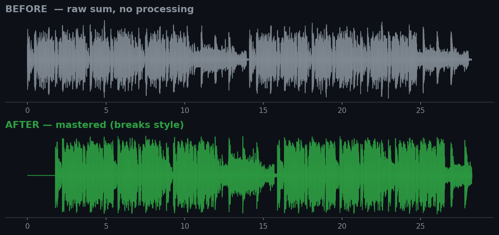

# MusicMixCode — Ableton Auto-Mix MCP

> 🇷🇺 [Читать на русском](README.ru.md)



An MCP server for auto-mixing and auto-mastering in Ableton Live **tuned to a musical style/genre**.
An AI agent (opencode, Claude Code, Claude Desktop...) analyzes render files of your tracks, compares them against a
style profile and produces/applies corrections: levels, pan, EQ hints, compression — and additionally renders a
mastered preview mix (sidechain, HPF, mud-cut, soft-clipper, true-peak limiter).

## Features

- **10 MCP tools**: analysis, style-based auto-mix, preview render, release check.
- **11 style profiles** (JSON): techno, hip_hop, pop, lo_fi, ambient, balanced, trance, breaks, dubstep, drum_n_bass, trap.
- **Mastering stage**: sidechain (kick → bass, snare-band Dynamic EQ), role-based HPF, 200–500 Hz mud-cut,
  tanh soft-clipper, LUFS normalization, true-peak lookahead limiter (4× oversampling), TPDF dither.
- **Stereo imaging**: mid/side width per role (mono for kick/sub, wide/very_wide for hats/pads) + panning.
- **Spectral role detection**: if the file name doesn't hint a role, it's inferred from the spectrum.
- **Release Check**: LUFS/LRA/true-peak/RMS/sub-mid-gap against top-label targets — `ready` / `needs_work` verdict.
- **Conflict analysis**: which track pairs fight over frequency bands.
- **Offline mode**: analysis and previews work without Ableton Live (only WAV renders are needed).

## Architecture

```
You → MCP client → ableton-auto-mix-mcp (MCP server)
                         ├── styles/*.json     — style profiles (target curves)
                         ├── analyzer.py       — LUFS/LRA, spectrum, stereo width (librosa/pyloudnorm)
                         ├── mixer.py          — engine: analysis vs profile → corrections (anchor = kick, LUFS)
                         ├── preview.py        — preview-mix render + mastering chain
                         ├── qa.py             — conflict analysis + release check
                         └── ableton_client.py — AbletonOSC (python-osc) → Ableton Live
```

Principle: **the MCP itself does not "mix"** — it provides tools and metrics while the model decides.
Cycle: render → analyze → dry-run report → preview mix → release check → apply corrections.

## Installation

```bash
pip install -r requirements.txt        # or: pip install -e .
```

Then connect the MCP server in your client (example for Claude Code / opencode):

```json
{ "mcpServers": { "ableton-auto-mix": {
    "command": "python", "args": ["-m", "ableton_auto_mix"],
    "cwd": "C:/path/to/ableton-auto-mix-mcp"
}}}
```

> Analysis and preview rendering do not require Ableton Live — one WAV per track is enough.

## Ableton setup (optional, for auto-apply)

1. Launch Ableton Live.
2. Install the **AbletonOSC** control surface (https://github.com/ideoforms/AbletonOSC).
3. Preferences → Link, Tempo & MIDI → Control Surface → AbletonOSC.
4. Bounce each track into `renders/` (one WAV per track) for analysis.

## MCP tools

| Tool | What it does |
|---|---|
| `list_styles` | list of styles and their targets |
| `get_style(name)` | full style profile (curve, balance, compression, FX) |
| `get_ableton_status` | check the connection to Live |
| `analyze_audio(path)` | metrics for one WAV |
| `analyze_render_dir(dir)` | metrics for all renders |
| `auto_mix(style, render_dir, dry_run)` | corrections for a style (dry-run or apply to Live) |
| `suggest_style(render_dir)` | which style fits your material best |
| `preview_mix(style, render_dir, ...)` | render a master-ready preview mix to WAV |
| `analyze_conflicts(render_dir)` | track pairs fighting for frequency bands |
| `release_check(style, render_dir)` | LUFS/TP/LRA vs label targets, `ready`/`needs_work` verdict |

## Example session

```
"Mix the renders from renders/ in a techno style, show what to change"
→ auto_mix("techno", "renders", true)

"OK, go ahead"
→ auto_mix("techno", "renders", false)

"Render a mastered preview mix"
→ preview_mix("breaks", "renders", max_duration=30)

"Check if the mix is release-ready"
→ release_check("breaks", "renders")
```

## CLI (without an MCP client)

Everything is available from the command line via `python -m ableton_auto_mix <command>`
(or `ableton-auto-mix-mcp <command>` after installing):

```bash
ableton-auto-mix-mcp styles                                  # list styles
ableton-auto-mix-mcp style breaks                            # style profile
ableton-auto-mix-mcp analyze renders/                        # metrics of all renders
ableton-auto-mix-mcp suggest renders/                        # which style fits
ableton-auto-mix-mcp mix breaks renders/                     # dry-run: what to change
ableton-auto-mix-mcp preview breaks renders/ --max-duration 30   # preview mix to WAV
ableton-auto-mix-mcp conflicts renders/                      # frequency conflicts
ableton-auto-mix-mcp release breaks renders/                 # ready/needs_work verdict
```

Output is JSON (script-friendly). Example: `preview breaks renders/ --manual-gain "bass=2.0,snt2=-4.0" --output out.wav`.

## Styles

Styles ship inside the package (`ableton_auto_mix/styles/`) — 11 profiles: techno, hip_hop, pop, lo_fi, ambient,
balanced, trance, breaks, drum_n_bass, trap.
Each profile defines: target LUFS/LRA, a spectral curve (6 bands), relative instrument levels
(kick/bass/vocals/lead/wobble/breaks/...), per-role HPF, mud-cut, sidechain, mastering settings, compression and
FX recommendations. You can add your own: copy a JSON and change `name` and targets.

To use custom styles without editing the package, point to an env var:

```bash
export ABLETON_AUTO_MIX_STYLES_DIR=/path/to/my-styles
```

## Tests

```bash
python tests/test_smoke.py   # 5 smoke tests: render → mix → preview → release check
```

## Limitations

- Analysis is done on **renders** (offline), since Live doesn't stream samples in real time via OSC.
- A track role is inferred from its filename; unknown names fall back to spectrum analysis (kick, bass, vocals...).
  Name tracks explicitly for accuracy.
- `auto_mix(dry_run=false)` requires a running Ableton Live with the AbletonOSC control surface.
- Preview mastering applies the profile's standard chain; do the final touch-up manually.

## License

[MIT](LICENSE) © 2026 MusicMixCode / HighVoltSound